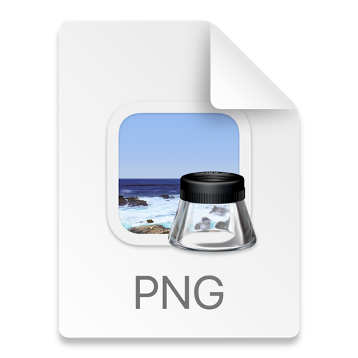

# CarBiddingService
Assessment of Cars24*7

# BiddingCarService

For Running the BiddingCarService Appliation Follow Below Steps:

1. First Use Java 11 Version and MysSql as database
2. In Application.properties file change the spring.datasource.url,spring.datasource.username,
   spring.datasource.password
3. create schema in mysql and use same schema in spring.datasource.url
4. Now run BiddingApplication.java which is main Class.
5. As we are using Spring Security so to access API you need to first hit http://localhost:8081/api/v1/auction/token
   with request body as in json sample mentioned belwo :
{
   "userName":"Admin",
   "password":"Admin"
}
6. Once you got token now copy that token and to run any of api in Header tab of postman
   create a new key-value pair key as Authorization and value as Bearer token

7. Now Run API

Please find below all Screenshot of 5 API :

1. api/v1/auction/token

2. api/v1/auction/createAuction

3. api/v1/auction/status/98

4. pi/v1/auction/placeBid?auctionId=98&dealerId=99&bidAmount=12000000000

5.api/v1/auction/details/98/winner-bid

